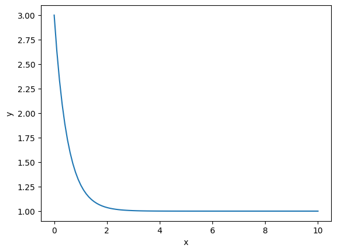

# Problem 3

## Newton's Laws of Motion

## 1. First Law (Law of Inertia)
> *An object at rest stays at rest, and an object in motion stays in motion with the same speed and in the same direction unless acted upon by an unbalanced external force.*

- Explains the concept of **inertia**.
- If no net force acts on an object, its velocity remains constant.
- Mathematically:
  $$
  \sum F = 0 \Rightarrow v = \text{constant}
  $$

## 2. Second Law (Law of Acceleration)
> *The acceleration of an object is directly proportional to the net external force acting on it and inversely proportional to its mass.*

- Defines the relationship between force, mass, and acceleration:
  $$
  F = ma
  $$
  where:
  - $F$ is the net force (N)
  - $m$ is the mass (kg)
  - $a$ is the acceleration ($m/s^2$)
- If force increases, acceleration increases (for constant mass).

## 3. Third Law (Action-Reaction Law)
> *For every action, there is an equal and opposite reaction.*

- Forces always occur in pairs.
- If object A exerts a force on object B, then object B exerts an equal and opposite force on object A:
  $$
  F_{A 	o B} = -F_{B 	o A}
  $$

## Applications
- **First Law:** Seatbelts in cars prevent passengers from continuing forward when a car stops suddenly.
- **Second Law:** A heavier object requires more force to accelerate than a lighter object.
- **Third Law:** When you push against a wall, the wall pushes back with an equal force.

## Summary Table
| Law | Description | Mathematical Form |
|------|-----------------|----------------|
| First | Inertia | $ \sum F = 0 \Rightarrow v = \text{constant} $ |
| Second | Acceleration | $ F = ma $ |
| Third | Action-Reaction | $ F_{A \to B} = -F_{B \to A} $ |


<<<<<<< HEAD

## Differential Equations

### 1. First Order
- **Linear:** $\frac{dy}{dx} + P(x)y = Q(x)$
- **Separable:** $\frac{dy}{dx} = f(x)g(y)$

### Example

Solve the following differential equation:
$$
\frac{dy}{dx} + 2y = 3
$$

### Solution

Given:
$$
\frac{dy}{dx} + 2y = 3
$$

### Python

```python
import numpy as np
import matplotlib.pyplot as plt

x = np.linspace(0, 10, 100)
y = 2 * np.exp(-2 * x) + 1

plt.plot(x, y)
plt.xlabel('x')
plt.ylabel('y')

plt.show()
```



=======

>>>>>>> 29eb383a907ac92c347a54a64e8c2abf214a084d
